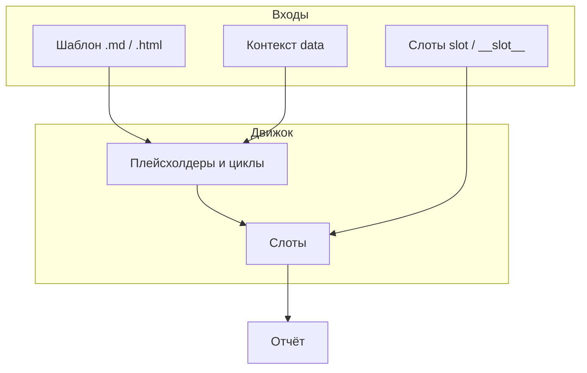

# Концепции relator

Короткий обзор того, из чего состоит отчёт.

## Поток работы

1. **Шаблон** — файл `.md` или `.html` с разметкой relator.
2. **Контекст** — именованные значения (таблицы, списки, текст, медиа, модели).
3. **Слоты** — именованные вставки `@@имя@@`, заполняемые **после** плейсхолдеров строкой произвольного текста.
4. **Результат** — строка (`render`) или файл (`compile`).

Подробная карта передачи данных: [data-flow.md](data-flow.md).

## Глоссарий

| Термин | Значение |
|--------|----------|
| `%%len=VAR%%` … `%%` | Цикл по последовательности `VAR`; внутри доступны `[[ITEM]]`, `[[CELL.*]]`, колонки `[[VAR.KEYS]]` и т.д. |
| `[[...]]` | Плейсхолдер; подставляется на первой фазе рендера. |
| `@@slot@@` | Слот; подставляется на второй фазе из `slot()` или `__slot__*` в `extra`. |
| Контекст | Словарь имя → значение, передаваемое в шаблон через `data([name, value])` или `compile_template`. |
| `assets_dir` | Папка, куда выкладываются файлы для `[[MEDIA.*]]`. |
| `sql_dialect` | Диалект SQL для интеграций `[[SQL.*]]` / `[[ORM.*.DDL]]`. |

## Диаграмма

## Дальше

- [Быстрый старт](getting-started.md)
- [Агенты и LLM](agents-and-llms.md)
- [Примеры вывода](rendering-samples.md)
- [Примеры в репозитории](examples.md)
