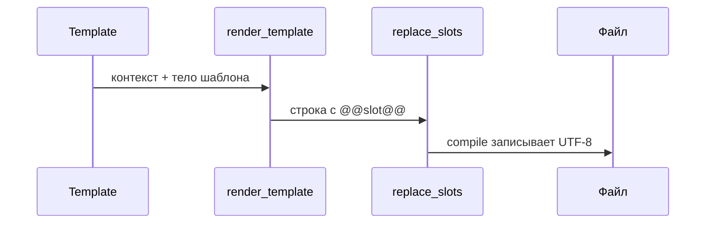

# Поток данных: шаблон, Python, JSON

Как relator подставляет значения и **в каком порядке** это происходит.

## Две фазы рендера

1. **Фаза плейсхолдеров и циклов** — весь текст шаблона обрабатывается движком: блоки `%%len=VAR%% … %%` разворачиваются, внутри и снаружи заменяются `[[...]]`. Реализация: `render_template` → `replace_placeholders` → `resolve_placeholder`.
2. **Фаза слотов** — в уже полученной строке ищутся маркеры `@@name@@` и подставляются значения из `template.slot(...)` и из ключей `extra` вида `__slot__name`. Реализация: `replace_slots` после первой фазы.

В слот передаётся **готовая строка** (часто Markdown от агента). Содержимое слота **не** интерпретируется как новый слой шаблона: вложенные `[[...]]` в тексте слота остаются обычным текстом.



## Элемент шаблона → откуда данные → форма значения

| Элемент | Источник в Python | Форма значения |
|--------|-------------------|----------------|
| `[[имя]]` или `[[имя.поле.подполе]]` | `template.data(["имя", value])` или ключ в `context` / JSON | Скаляр, `dict`, объект с атрибутами — доступ по цепочке точек |
| `%%len=VAR%%` … `[[ITEM]]`, `[[CELL.*]]` | `template.data(["VAR", sequence])` | Последовательность (не строка/bytes); элементы — строки или mapping |
| `[[VAR.KEYS]]`, `[[VAR.DIVIDER]]`, `[[VAR.VALUES]]`, `[[VAR.TABLE]]` | Та же переменная `VAR` в контексте | Для KEYS/DIVIDER/VALUES/TABLE внутри строк — список mapping; `VALUES` — только внутри своего `%%len=VAR%%` |
| `[[TABLE.var]]`, `[[TABLE.var.NUMBERED]]`, `[[TABLE.var.INDEX0]]`, `[[TABLE.var.HTML]]` | `template.data(["var", rows])` | Список dict с общими ключами колонок |
| `[[LIST.var]]`, `[[ENUM.var]]` | `template.data(["var", list])` | Последовательность элементов |
| `[[MEDIA.var]]` (+ `.PATH`, `.MD`, `.HTML`) | `template.data(["var", …])` | PIL `Image`, `matplotlib.figure.Figure`, путь `Path`/`str` — см. [python-api.md](python-api.md) |
| `[[PYDANTIC.*]]`, `[[SCHEMA.*]]` | Модель / класс / `TypeAdapter` | Нужен пакет `relator[pydantic]` — [integrations.md](integrations.md) |
| `[[SQL.*]]`, `[[ORM.*]]` | Строка, `Executable`, `Table`, mapped-класс | [integrations.md](integrations.md), при SQLAlchemy задайте `sql_dialect` в конструкторе |
| `@@slot_name@@` | `template.slot("slot_name", "строка")` или `render`/`compile` с `extra={"__slot__slot_name": "…"}` | **Только строка**; не ключ контекста для `[[...]]` |

## Параметры вне словаря контекста

| Параметр | Где задаётся | Назначение |
|----------|--------------|------------|
| `assets_dir` | `Template(..., assets_dir=…)` | Каталог для экспорта файлов медиа |
| `sql_dialect` | `Template(..., sql_dialect="sqlite"\|"postgresql"\|"mysql")` | Диалект для `[[SQL.*]]` и `[[ORM.*.DDL]]` |
| Кодировка | Внутри библиотеки UTF-8 | Чтение шаблона и запись отчёта |

## Три способа задать данные

### 1. Пошагово (`Template`)

```python
from reporting import Template

t = Template("tpl.md", assets_dir="assets", sql_dialect="sqlite")
t.data(["rows", [{"A": 1}]])
t.slot("note", "_Произвольный Markdown._")
t.compile("out.md", extra={"__slot__footer": "v1"})
```

### 2. Функционально (`compile_template`)

```python
from reporting import compile_template

compile_template(
    "tpl.md",
    {"rows": [{"A": 1}], "__slot__note": "текст"},
    "out.md",
    assets_dir="assets",
)
```

Ключи с префиксом `__slot__` из словаря контекста при компиляции **не** попадают в данные для `[[...]]`: они передаются как слоты (см. реализацию `compile_template`).

### 3. CLI

```bash
relator --template tpl.md --context context.json --output out.md
```

В `context.json` допустимы обычные ключи переменных и ключи `__slot__имя` для слотов. Сложные объекты (PIL, ORM) через JSON не задаются — используйте Python.

## Пример: что окажется в файле отчёта

**Шаблон** `report.md`:

```markdown
# [[title]]

[[TABLE.rows]]

@@note@@
```

**Данные:** `title` → `"Отчёт"`, `rows` → `[{"x": 1}, {"x": 2}]`, слот `note` → `"_Конец._"`

**Содержимое файла после `compile`** (как в редакторе / на GitHub):

```markdown
# Отчёт

|x|
|---|
|1|
|2|

_Конец._
```

Это и есть «результат рендера»: обычный Markdown без маркеров `[[...]]` и `@@...@@`.

## Связанные страницы

- [Концепции](concepts.md) — глоссарий и обзор
- [Синтаксис шаблонов](template-syntax.md)
- [Справочник плейсхолдеров](placeholders.md)
- [Примеры готового вывода](rendering-samples.md)
- [Python API](python-api.md)
- [CLI](cli.md) — в том числе `relator inspect` для манифеста шаблона
